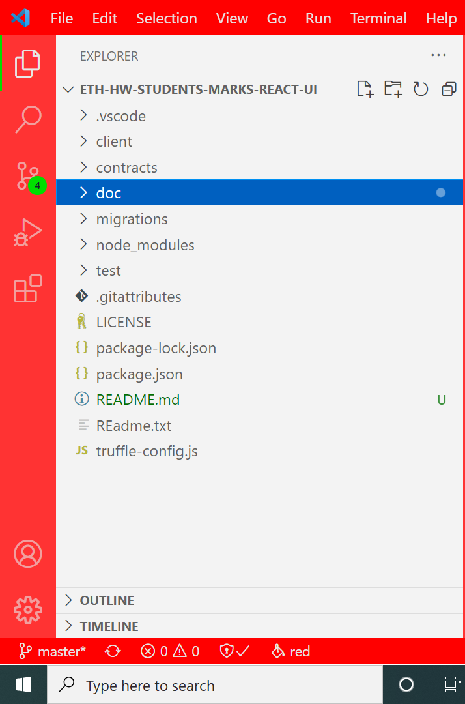

## Scope of POC
The project tries to explain the a Student's marks track record in Etherium Block Chain implementation. The solution exibits the power of developing Smart Contracts using Solidity Language, and JS integration with web3js library.

## Development Tools

1) Visual Studio Code - Latest
2) NodeJS - 14.X or Latest
3) Solidity Compiler ($> npm install --global solc)
4) Truffle npm Package
   ##### $> npm install truffle --global 
5) Ganache - select the one that matches your operating system

## Setup the Dev Environment

1) Setup the project environment, by running the following command
    - truffle unbox react
2) You will be getting following project structure

3) Start the Ganache Server, which will similulate a etherium blockchain network

4) Project Configuration to connect to Ganache Server
    * open the file _truffle-config.js_ , delete the file contents & replace with following contents(this will configure our truffle project to connect to Ganache and sets the Solidity compiler version to ^0.8.7)
```JS
const path = require("path");
module.exports = {
  contracts_build_directory: path.join(__dirname, "client/src/contracts"),
  networks: {
    development: {
      host: "127.0.0.1",
      port: 7545,
      network_id: "*" // Match any network id
    }
  },
  compilers: {
    solc: {
      version: "^0.8.7"
    }
  }
};
```

## Step 1 - Develop Smart Contract

Before trying to understand following solidoty code, try to grab some basics syntax of the same.

The basic structure of my Smart Contract _StudentManager.sol_ will look like 
```java
// SPDX-License-Identifier: MIT
pragma solidity ^0.8.6;

import "./Student.sol";
import "./Mark.sol";
import "./Ownable.sol";
  
contract StudentManager is Ownable {
    //Methods and Standard Functions.
}
```

Lets update the code with standard logic

```java
contract StudentManager is Ownable {

    enum GradeState {   
        A,
        B
    }

     struct stu_marks {
        Student _student;   
        Mark[] _marks;
        string  _dept;
        GradeState _gState;
    }

    event StudentChainStep(uint _itemIndex,uint _grade, address _stuAddress);
    event MarksEvent(Mark mrk);
    event logger(string data);

    mapping(uint => stu_marks) public students;

    function createStudent(uint stuIndex,uint id,string memory name,string memory email) public {
        Student stu = new Student(id,name,email);
        students[stuIndex]._student = stu;
        emit StudentChainStep(stuIndex,0, msg.sender);
    }

    function addMarks(uint stuIndex,string memory subject,uint score) public  {
        Mark mark = new Mark(subject,score);
        students[stuIndex]._marks.push(mark);
        students[stuIndex]._dept = "MECH";
        uint cgpa = mark.getCGPA();
        if (cgpa > 50){ 
            students[stuIndex]._gState =GradeState.A;
        } else {
            students[stuIndex]._gState =GradeState.B;
        }
        emit StudentChainStep(stuIndex,uint(students[stuIndex]._gState), msg.sender);
    }

    function getStudent(uint idx) public returns(Student){
        return students[idx]._student;
    }

    function getMarks(uint idx) public returns(Mark[] memory){
        emit logger("===1");
        emit logger("===2");


        for (uint i = 0; i < students[idx]._marks.length; i++) {
            emit logger("===========");
            emit MarksEvent(students[idx]._marks[i]);
        }
        
        return  students[idx]._marks;
    }

    function getMark(uint idx,uint midx) public returns (string memory,uint){
        Mark m = students[idx]._marks[midx];
        return (m.subject(),m.marks());
    }

}
```